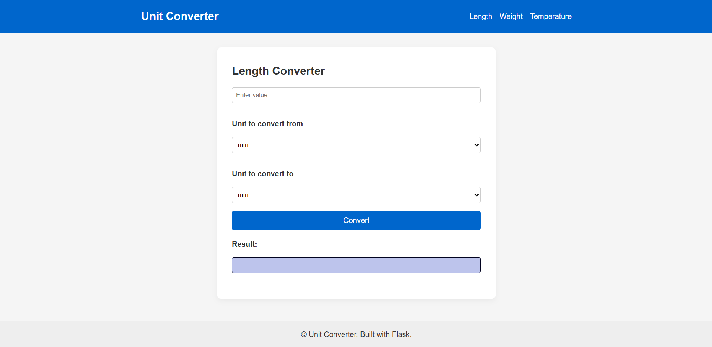

# Unit Converter Web App

A simple web application built with Flask that allows users to convert between different units of measurement — including **Length**, **Weight**, and **Temperature**.

---

<a href="https://roadmap.sh/projects/unit-converter" target="_blank">

</a>

## Features

- Convert between various units of:
  - **Length**: millimeter, centimeter, meter, kilometer, inch, foot, yard, mile
  - **Weight**: milligram, gram, kilogram, ounce, pound
  - **Temperature**: Celsius, Fahrenheit, Kelvin
- Simple user interface
- Built without using any frontend frameworks (no Bootstrap)
- Clean, modular code using `Enum` and separate conversion logic

---

## Project Structure

```
unit_converter/
│
├── app.py                      # Main Flask application
├── templates/
│   ├── base.html               # Base template with block content
│   ├── length.html             # Length conversion page
│   ├── weight.html             # Weight conversion page
│   └── temperature.html        # Temperature conversion page
│
├── static/
│   └── style.css               # Custom styling
│
├── models/
│   ├── length.py               # Enum for length units
│   ├── weight.py               # Enum for weight units
│   └── temperature.py          # Enum for temperature units
│
├── tests/
│   ├── __init__.py
│   ├── test_length_conversion.py               # tests for length conversion
│   ├── test_weight_conversion.py               # tests for weight conversion
│   ├── test_temperature_conversion.py          # tests for temperature conversion
│   └── test_routes.py                          # tests for app routes
│
├── conversions.py              # contains conversion logic
│
├── requiremetns.txt            # contains all required packages
│
└── README.md
```

---

## Getting Started

### 1. Clone the Repository

```bash
git clone https://github.com/AElalfee/unit_converter.git
cd unit-converter
```

### 2. Create virtual environment

Make sure you're in your project directory and it's best to do this inside a virtual environment to avoid version conflicts:
```bash
python -m venv venv
source venv/bin/activate   # On Windows, use: venv\Scripts\activate
```

### 3. Install all packages

```bash
pip install -r requirements.txt
```


### 4. Run application

```bash
flask --app app run
```

Then visit `http://localhost:5000` in your browser.

### 5. To run tests

```bash
 pytest
===================================================== test session starts ======================================================
platform win32 -- Python 3.13.5, pytest-8.4.1, pluggy-1.6.0
collected 13 items                                                                                                              

tests\test_length_conversion.py ...                                                                                       [ 23%]
tests\test_routes.py ...                                                                                                  [ 46%]
tests\test_temperature_conversion.py ....                                                                                 [ 76%]
tests\test_weight_conversion.py ...                                                                                       [100%]

====================================================== 13 passed in 0.25s ======================================================
```
---